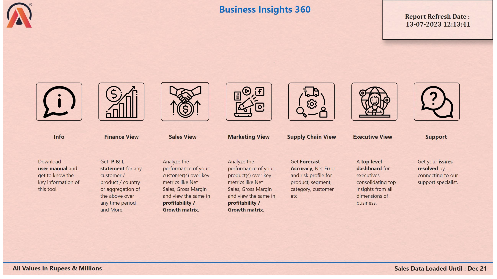
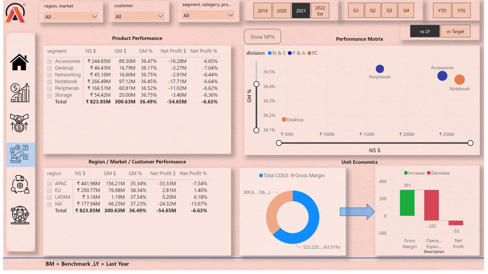
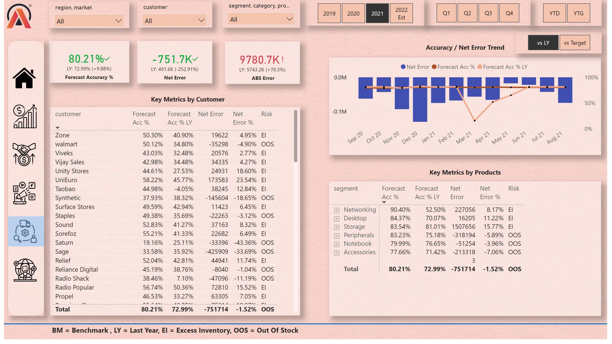
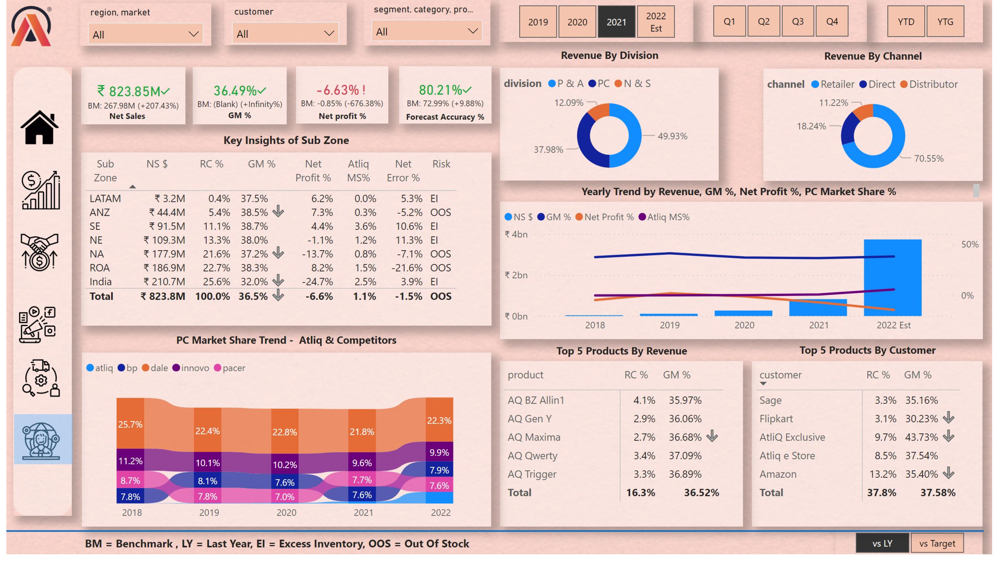
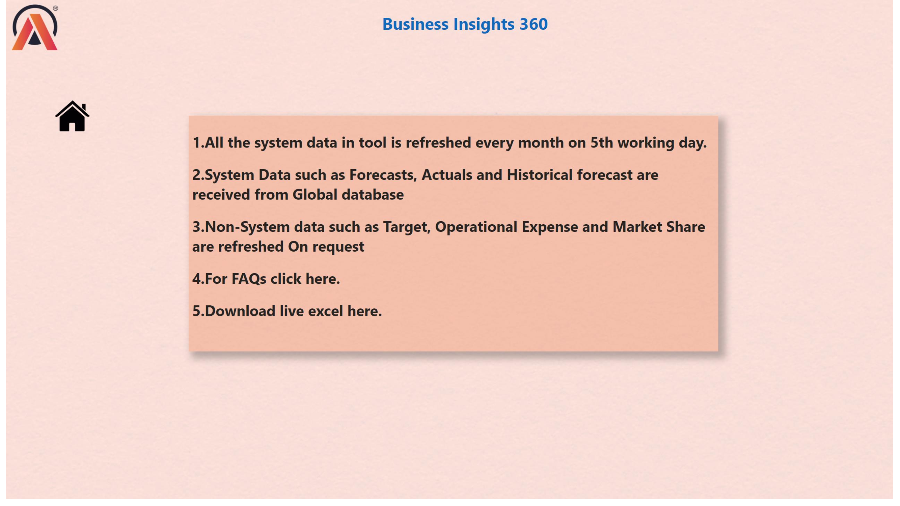

# AtliQ Hardware Data Analytics Project

![AtliQ Hardware]

Welcome to the AtliQ Hardware Data Analytics project repository! In this project, we have implemented data analytics using Power BI to empower AtliQ Hardware with the ability to make data-driven decisions, surpass competitors in the market, and drive growth in various aspects of their business, including finance, sales, marketing, and supply chain management.

You can watch the presentation video [**here**]

## Table of Contents

- [Introduction](#introduction)
- [Tech Stacks](#tech-stacks)
- [Business Terminology](#business-terminology)
- [Company Background](#company-background)
- [Dataset](#dataset)
- [Dashboard](#dashboard)

## Introduction

AtliQ Hardware, a global leader in computer and computer accessories sales, has embarked on a journey to leverage the power of data analytics using Power BI. This project aims to provide answers to stakeholders' questions related to finance, sales, marketing, and supply chain management, enabling the company to stay ahead in the competitive market landscape.

## Tech Stacks

- Power BI
- Excel
- DAX Language
- DAX Studio

## Business Terminology

- **Gross Price**: The total price of a product or service before any deductions, such as taxes or discounts, are applied.

- **Pre-Invoice Deductions**: Deductions made from the gross price before an invoice is generated. These could include discounts, allowances, or other adjustments.

- **Post-Invoice Deductions**: Deductions made after an invoice is generated. These deductions might involve returns, rebates, or adjustments that affect the final amount the customer pays.

- **Net Invoice Sale**: The final amount after deducting both pre-invoice and post-invoice deductions from the gross price.

- **Gross Margin**: The difference between the revenue generated from sales and the cost of goods sold (COGS). It indicates how much profit a company makes from its core business operations.

- **Net Sales**: The total revenue generated from sales after deducting returns, allowances, and discounts.

- **Net Profit**: The total profit a company earns after deducting all expenses, including COGS, operating expenses, and taxes, from its total revenue.

- **COGC (Cost of Goods Sold)**: The direct costs associated with producing the goods that a company sells. It includes the cost of raw materials, labor, and manufacturing overhead.

- **YTD (Year to Date)**: Refers to the period starting from the beginning of the current calendar year up to the present date. It's often used to analyze performance or financial metrics within a specific timeframe.

- **YTG (Year to Go)**: Refers to the remaining period in the current calendar year, starting from the present date and extending until the end of the year.

- **Direct**: A sales channel where products are sold directly from the manufacturer or company to the end consumer without intermediaries.

- **Retailer**: An entity that purchases products from manufacturers or wholesalers and sells them to consumers, often through physical or online stores.

- **Distributors**: Entities that purchase products in bulk from manufacturers and then sell them to retailers or other businesses. They help bridge the gap between manufacturers and retailers.

- **Consumer**: The end-user or customer who purchases and uses the products or services offered by a company.

## Company Background

AtliQ Hardware is a rapidly growing company that specializes in selling computers and computer accessories through three primary channels:

1. Retailers
2. Direct Sales
3. Distributors

With a global presence, the company has expanded its business operations significantly in recent years.

## Dataset 

### Dimension Tables

### `dim_customer`
- Contains details of customers across markets and platforms.
- 27 distinct markets.
- 75 distinct customers.
- 2 types of platforms: Brick & Mortar (Physical/offline store), E-commerce (Online Store).
- Three channels: Retailer, Direct, and Distributors.

### `dim_market`
- Contains details of markets, sub-zones, and regions.
- 27 distinct markets.
- 7 sub-zones.
- 4 regions: APAC, EU, NA, LATAM.

### `dim_product`
- Contains details of product divisions, categories, and variants.
- Divisions: P & A, Peripherals, Accessories, PC, Notebook, Desktop, N & S, Networking, Storage.
- 14 different categories (e.g., Internal HDD, keyboard).
- Different variants available for the same product.

### Fact Tables

### `fact_forecast_monthly`
- Used for forecasting customer needs in advance.
- Helps improve customer satisfaction and reduce warehouse storage costs.
- Denormalized for analytical use.
- Date of the month replaced by start date.
- Columns include forecast quantity needed by the customer.

### `fact_sales_monthly`
- Similar to `fact_forecast_monthly` with actual sold quantities.

### Additional Tables

### `gdb056`
- `freight_cost`: Details of travel and other costs for each market by fiscal year.
- `gross_price`: Details of gross prices with product code.
- `manufacturing_cost`: Details of manufacturing costs with product code and year.
- `Pre_invoice_dedutions`: Details of pre-invoice deduction percentages for each customer by year.
- `Post_invoice_deductions`: Details of post-invoice and other deductions.

This dataset provides comprehensive information about customers, markets, products, and various costs. The dimension tables offer static data, while the fact tables provide transactional and forecasting insights. Analyzing this dataset can lead to valuable insights for optimizing sales, costs, and customer satisfaction.

## Data Model

Data modeling plays a pivotal role and serves as the foundation for generating meaningful reports. The entire framework of visualizations is constructed upon a well-designed data model. Neglecting proper data modeling can have adverse effects on the overall performance of the generated reports.

In the context of this project, we have meticulously followed the Snowflake data modeling method. This approach involves structuring data into normalized forms, resulting in reduced redundancy and improved query performance. This methodology enhances the way we organize and process data, ensuring optimal results for our analysis.

Remember, a robust data model is the cornerstone of effective data analysis and reporting. By employing sound data modeling practices, we can confidently generate insightful visualizations that empower data-driven decision-making.

## Dashboard

You can find the interactive dashboard [**here**]
### Home View

### Finance View

### Sales View

### Marketing View

### Supply Chain View

### Executive View

### Info Page

